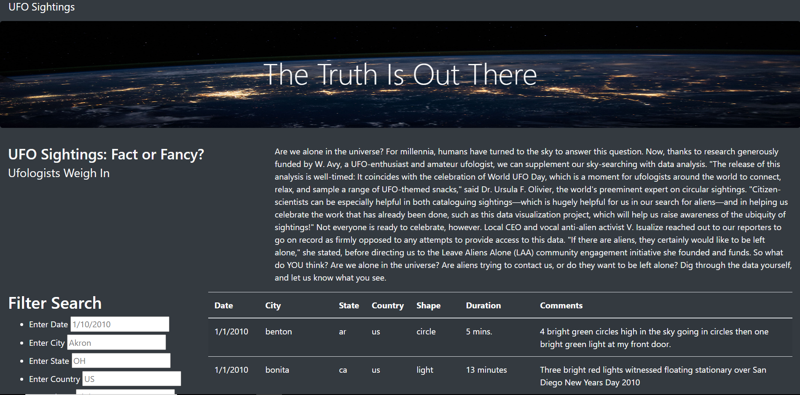

## UFO Analysis
# Purpose

The purpose of this challenge wasto learn how to create a table to organize data stored in JavaScript as an array, or list. It was also to learn how to visually adjust the information as elements change, i.e. filtering. We also used HTML, Bootstrap and CSS to create and customize a webpage that is easy for the user to view and navigate.

# Overview

Is there anyone or anything else out there? UFO sightings have been a fascination among many people for years. There have been many stories and testimonies that often have you asking yourself, is this real? In fact, there has been news of 4 recent shootdowns of unidentified objects just days ago, and we are wondering... are they UFOs? We have been tasked with helping our client, Dana, with building a webpage where others can access information of reported sightings and investigate on their own. The webpage includes:

    * A summary of the topic
    * A table to display all of the UFO sightings reported.
    * Search filters that update the table based on the users' input.

[label](static/images/images.jfif)

# Results
The webpage, https://davis4a6.github.io/UFOs/ was created. When the user opens the website, this is what they will see.

In order to begin a search, you navigate to the Filter Search bar pictured here. The search field boxes have placeholders to give the user an example of what they could input into the box.

The user can customize their search by adding in the search criteria they are looking for based on each input. In this image, the search is filtered by sightings in California, with the shape of a light.

# Summary
As with any project, this page has a few drawbacks, or things we could improve upon. They include:
    * The search field does not automatically reset. This forces the user to   
    backspace and delete if they should want to change their filter search to something else.

    * The data provided in the table is limited and not connected to a "live-updated" source.

In the future, some recommendations that I can make to further develop this webpage are:
    1. Adding a function to automatically reset the search bar so the user is not inconvienenced.

    2. Add a function to pull data from a live source that includes both current and past data.

    3. Add a section that displays recent news articles of reported sightings. For example, the recent news of the 4 shootdowns of "unidentified objects" in the US. This would give users another resource to connect their findings to.
